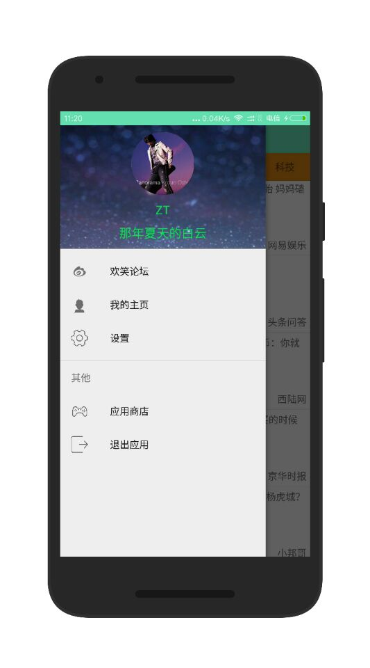
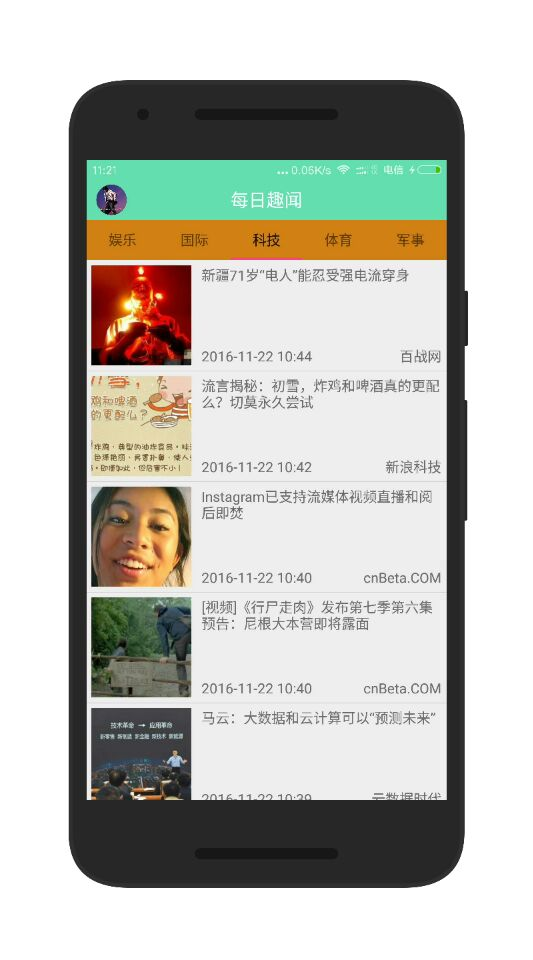
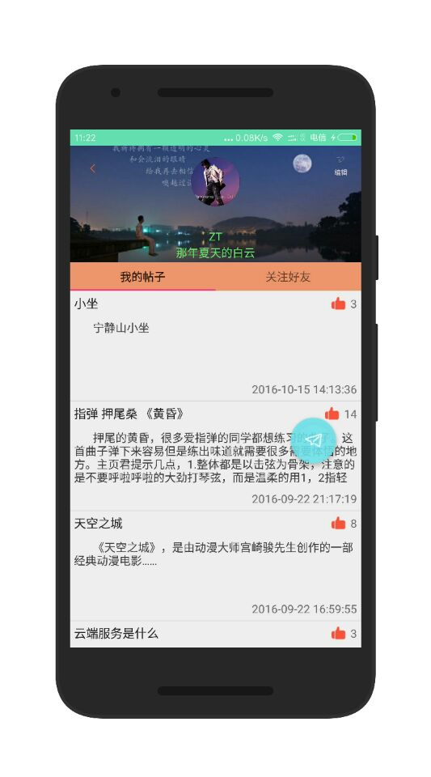
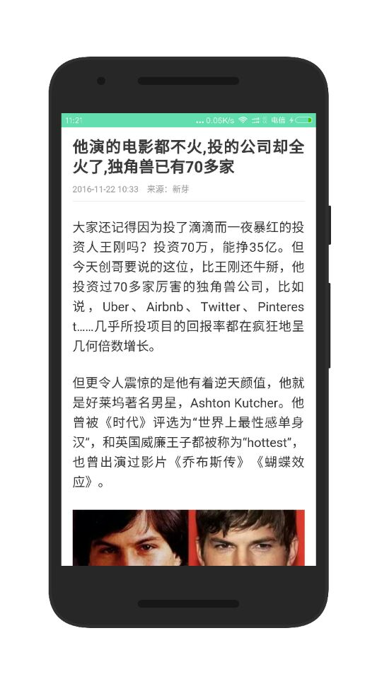

# 每日趣闻
每日趣闻 每日为您推送全国各类趣闻信息，趣闻段子，生活趣事，明星娱乐，国内外最新的娱乐信息，无论你是星迷 还是科技迷...让你足不出户 就能了解到国内外各行各业,各领域方面的最新消息，赶快下载体验吧...
##一、应用截图
<a href="screenshot/2.jpg"><a/>
<a href="screenshot/3.jpg"><a/><a href="screenshot/4.jpg"><a/>
##二、项目技术框架
1,应用数据：聚合数据 
2,应用后台：Bmob 
3,图片加载：Picasso 
4,上拉刷新下拉加载：Android-PullToRefresh 
5,圆形头像：android-shape-imageview 
6,项目整体UI风格： Material Design 
7,短信验证码：Mob SMSSDK 
8,分享功能:Mob ShareSDK
##三、About Me 
1,邮箱:1356798719@qq.com 
2,CSDN博客：[http://blog.csdn.net/kkijhuybjju?viewmode=contents](http://blog.csdn.net/kkijhuybjju?viewmode=contents)
##四、声明
  数据接口来源聚合数据，仅用于非商业用途，如做为商业使用，请自行联系接口提供方。本人概不负责。
